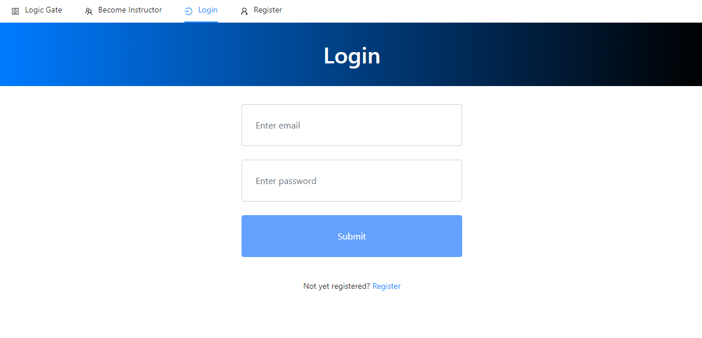
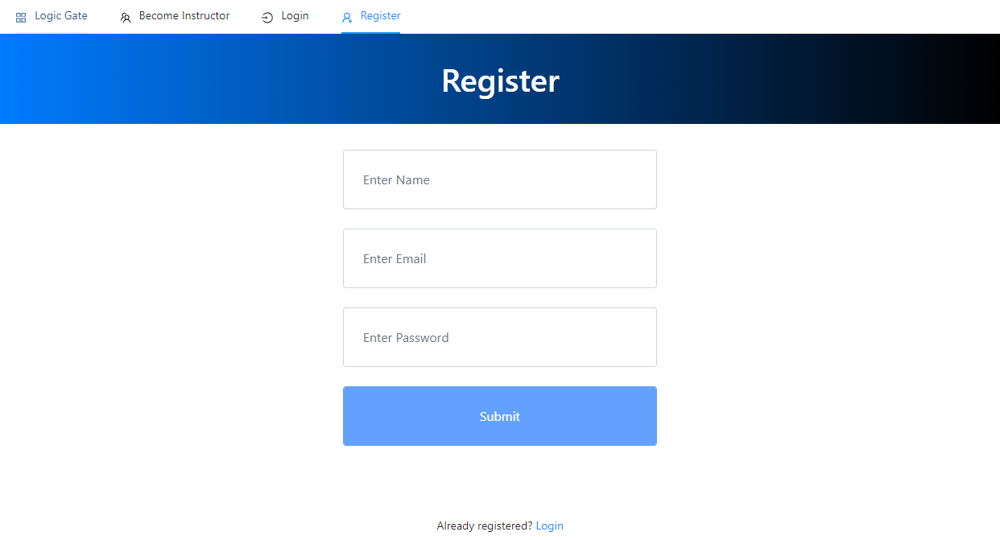
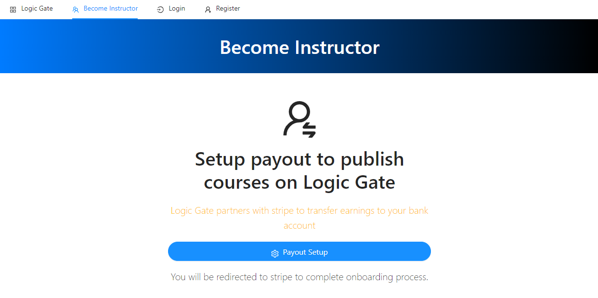

# Logic Gate
Individual project
Team Member: Jianming Lu (Solo)
## Piazza post (10 points)
Please check piazza LogicGate #Iter1.

## Working app (45 points)
Please check the link below.
https://lg-fe.herokuapp.com/

## App progress (15 points)
I built the existing app from scratch. This is iteration 1. All progress so far has been displayed below. The screenshot will be shown in the next section.

1. Most top-level routes are finished including the home page, login page, register page, and become instructor page. Users can click the top navbar to go to each page.
2. Home page is mostly done. Since no courses have been uploaded yet, there will be one hard-coded sentence.
3. Login page is done, user can login by using email and password after register an account.
4. Register page is done. Users can register an account by providing their username, email, and password.
5. Login and register have been connected to MongoDB Atlas, so user data can be saved in the database.
6. User dashboard page structure is done, user can see it after login. However, not been able to add courses yet.
7. Become Instructor page is done, but not connect to Stripe service yet, will do this later.

## Readme/screenshots (15 points)
Screenshot:
Home Page:

Login Page:

Register Page:

Become Instructor Page:

User Dashboard Page:

## GitHub contributor uniformity (5 points)
Individual project
Jianming Lu (100%)

## GitHub commits/versions/comments (10 points)
Please check the link below.
https://github.com/lujianming000/LogicGate
