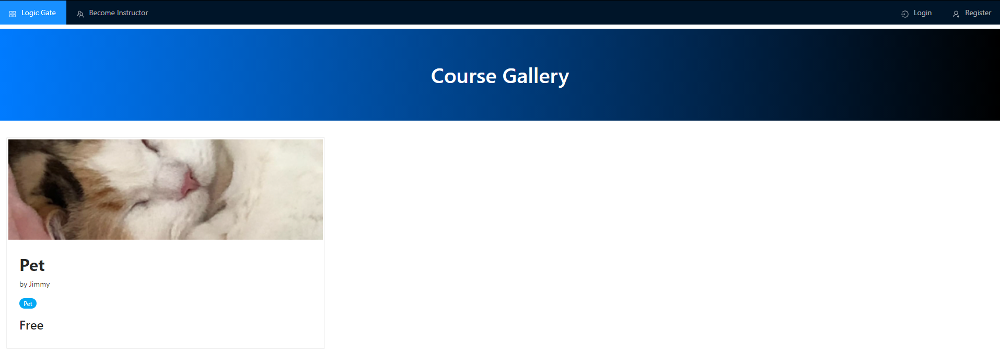
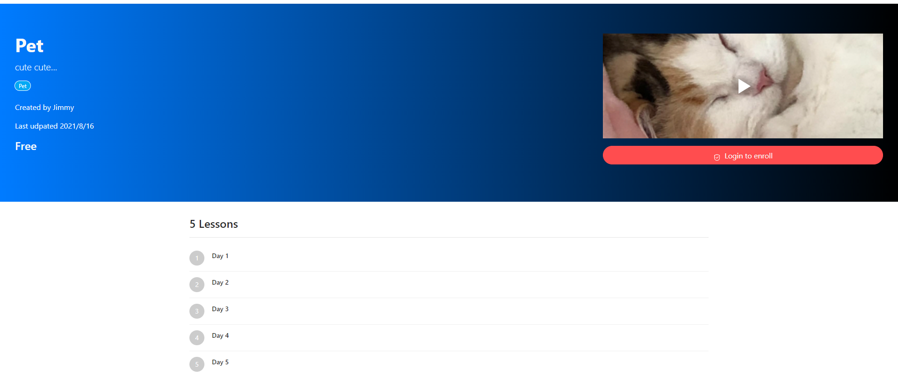
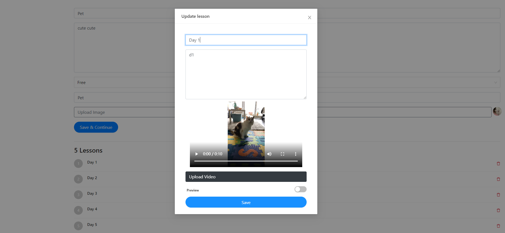
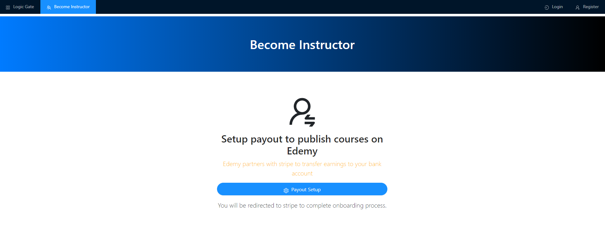
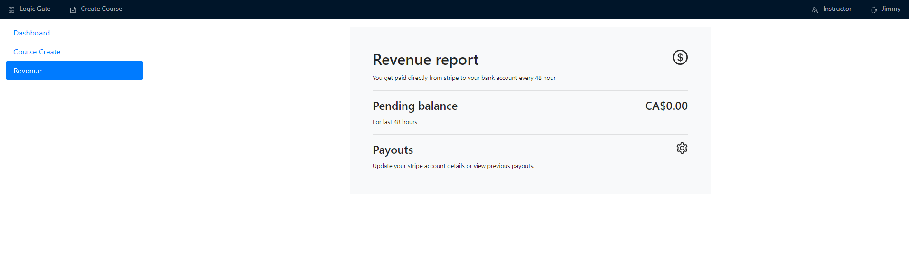
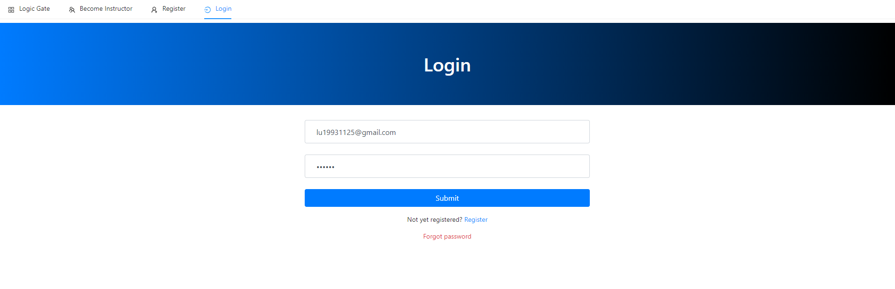
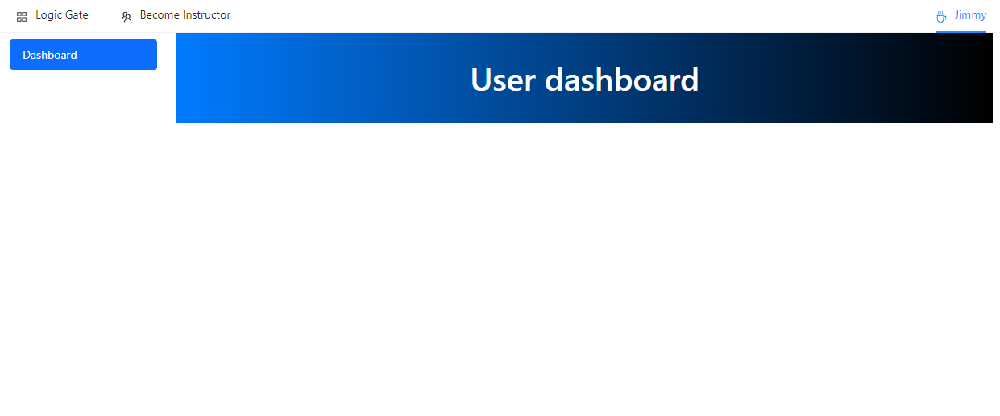

# Logic Gate
Individual project
Team Member: Jianming Lu (Solo)

## Iteration 3
### Piazza post (10 points)
Please check piazza LogicGate #Iter3.

## Iteration 3
### Piazza post (10 points)
Please check piazza LogicGate #Iter3.

### Working app (45 points)
Please check the link below.
http://137.184.3.16/

### App progress (15 points)
The app has been completed. It's a simple app with some general styling but It has all functions. The progress from the last iteration is below.

1. On the course gallery page, users could see a list of courses.
2. Users can see the course page and course preview when users click the course on the gallery page.
3. Users and instructors can see the lesson page once clicking the lesson on the course page.
4. Instructors can edit the lesson.
5. Courses can be free enrolled or paid enrolled.
6. Instructors can see their revenue on the instructor dashboard.

### Readme/screenshots (15 points)
Screenshot:
Course Gallery Page:

Course Page:

Lesson Page:

Lesson Edit Page:

Account Page:

Revenue Page:

### GitHub contributor uniformity (5 points)
Individual project
Jianming Lu (100%)

### GitHub commits/versions/comments (10 points)
Please check the link below.
https://github.com/lujianming000/LogicGate

## Iteration 2
### Piazza post (10 points)
Please check piazza LogicGate #Iter2.

### Working app (45 points)
Please check the link below.
http://137.184.3.16/

### App progress (15 points)
All progress so far has been displayed below. The screenshot will be shown in the next section.

1. The app has been connected to Stripe, users can become instructors after providing some information.
2. Users can reset their password after click the forgot password on the login page. Users need to check their email to get the secret code first. The service is provided by AWS. Users may not be able to use this service since the service account is still in the sandbox. Please contact me if you want to test it.
3. Instruction board is done. The sidebar includes the course dashboard and creates a course. 
4. Course creation page is done. Users can create some courses after login in as an instructor.
5. Course update page is done. Users can make some changes after the course has been made.
6. Instructor could add the lesson to the course.
7. Add lesson modal is done, which includes videos, title, and description.

### Readme/screenshots (15 points)
Screenshot:
Forgot Password Page:

Instructor Dashboard Page:

Course Page:

Course Create Page:

Course Edit Page:

Add Lesson Page:

### GitHub contributor uniformity (5 points)
Individual project
Jianming Lu (100%)

### GitHub commits/versions/comments (10 points)
Please check the link below.
https://github.com/lujianming000/LogicGate

## Iteration 1
### Piazza post (10 points)
Please check piazza LogicGate #Iter1.

### Working app (45 points)
Please check the link below.
http://137.184.3.16/

### App progress (15 points)
I built the existing app from scratch. This is iteration 1. All progress so far has been displayed below. The screenshot will be shown in the next section.

1. Most top-level routes are finished including the home page, login page, register page, and become instructor page. Users can click the top navbar to go to each page.
2. Home page is mostly done. Since no courses have been uploaded yet, there will be one hard-coded sentence.
3. Login page is done, user can login by using email and password after register an account.
4. Register page is done. Users can register an account by providing their username, email, and password.
5. Login and register have been connected to MongoDB Atlas, so user data can be saved in the database.
6. User dashboard page structure is done, user can see it after login. However, not been able to add courses yet.
7. Become Instructor page is done, but not connect to Stripe service yet, will do this later.

### Readme/screenshots (15 points)
Screenshot:
Home Page:

Login Page:

Register Page:

Become Instructor Page:

User Dashboard Page:

### GitHub contributor uniformity (5 points)
Individual project
Jianming Lu (100%)

### GitHub commits/versions/comments (10 points)
Please check the link below.
https://github.com/lujianming000/LogicGate
